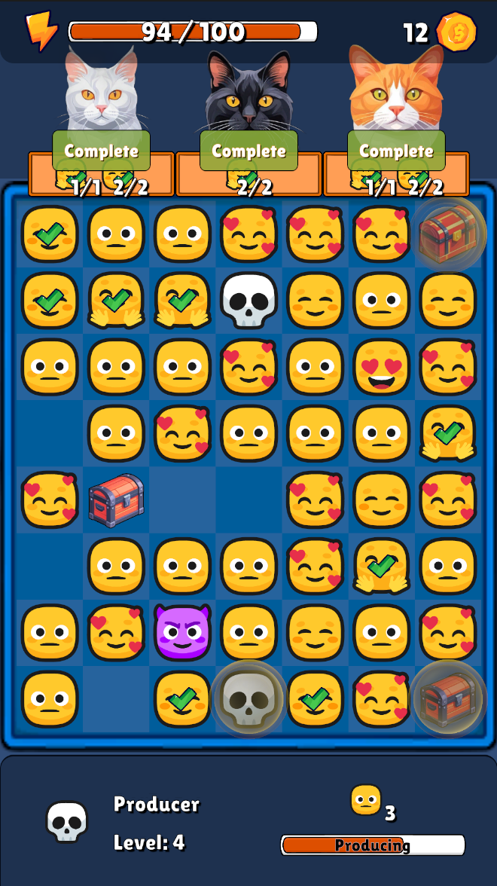

# Emoji Merge

A merge-style game where you fulfill orders by combining emoji items and selling them to cats. The game features a grid-based board, energy management system, and item production/merging mechanics.

<center></center>
(9:16 Portrait Aspect is Recommended)

## Game Overview

In Emoji Merge, you:
- Merge identical emoji items to create higher-level versions
- Manage an energy system that recharges over time
- Use Producer items to create new emoji items
- Open Chests to get Energy and Coins
- Complete orders from cats to earn rewards

## Key Features

### Grid System
- Configurable grid size for item placement
- Drag-and-drop merging mechanics

### Energy System
- Start with 100 energy
- Energy recharges +1 every 60 seconds
- Producer items consume energy when producing new items
- Energy pickups from chests can be merged for higher rewards

### Producer Items
- Level 4-5 producers can generate emoji items
- Visual effects indicate when ready to produce

### Chest Items
- Generate Energy and Coin consumable items
- Chests require 60 seconds to unlock

### Order System
- Cats request specific emoji items
- Complete orders to earn coins
- Orders can request 1-2 items

### Visual Effects
- Item spawn effects
- Merging glow animations
- Producer ready indicators

## Technical Structure

The project uses Unity's ScriptableObject architecture with a robust component-based design for modularity and extensibility:

### Architecture Overview

The project follows a combination of design patterns including:

- **Singleton Pattern** for core managers (GameManager, GridManager, UIManager)
- **Observer Pattern** for system communication via events
- **ScriptableObject Architecture** for data-driven game design
- **Component-Based Design** for modular and reusable behaviors

### Core Systems

#### GameManager
- Central controller implementing the Singleton pattern
- Manages game state, energy system, and currency
- Coordinates between systems using event-driven communication
- Handles timing-based mechanics (energy recharge)

#### GridManager
- Handles the game board's layout and cell management
- Implements a flexible grid sizing system with configurable dimensions
- Provides spatial queries for finding items and empty cells
- Manages item placement and movement with position validation
- Features a sophisticated input handling system for drag-and-drop operations
- Supports dynamic grid resizing and styling

#### MergeManager
- Detects and processes mergeable items
- Implements rule-based merging logic with level progression
- Handles item combination with visual effects
- Triggers appropriate rewards and progression events

#### Energy System
- Implements a timed recharge mechanic (+1 energy every 60 seconds)
- Provides energy availability checks for producer items
- Features UI warnings for insufficient energy
- Includes pickup items that can be merged for increased energy gains

#### Order System
- Generates random orders from predefined configurations
- Tracks order completion with item requirements
- Handles reward distribution when orders are fulfilled
- Supports multi-item orders with varying difficulties


### Item System

The game uses a flexible item system with base classes and specific implementations:

```
GridItem (Base Class)
├── ConsumableItem
│   ├── EnergyItem
│   └── CoinItem
├── ProducerItem
├── ChestItem
└── EmojiItem
```

Each item type inherits core behaviors while implementing specialized functionality:

- **GridItem**: Base class with positioning, dragging, and merging capabilities
- **ProducerItem**: Generates items based on configurable parameters
- **ChestItem**: Unlocks after a timer to provide rewards
- **ConsumableItem**: Can be tapped to grant resources

### Input System

The game uses a custom input system that handles:

- Touch/click detection for item interaction
- Drag-and-drop operations for merging
- Position mapping between screen and grid coordinates
- Multi-touch support with prioritization

### Extension Points

The architecture is specifically designed for easy expansion:

1. **Item System**: New item types can be added by extending the GridItem class
2. **Producers**: New producer behaviors can be created with custom ScriptableObjects
3. **Orders**: The order system supports adding new order types with custom requirements
4. **VFX System**: Particle effects can be easily swapped or enhanced via prefabs
5. **Level Generation**: Supports both predefined and procedurally generated levels

## Extending the Game

### Adding New Emoji Items
1. Create a new sprite in the Resources/Image/Items folder
2. Create a new ItemSO in ScriptableObjects/Items
3. Configure its properties (name, sprite, level, merge result)
4. Add it to the ItemDatabase ScriptableObject

### Adding New Orders
1. Create a new OrderSO in ScriptableObjects/Orders
2. Configure the required items and reward amounts
3. Add it to the OrderDatabase ScriptableObject

### Adding New Producer/Chest Types
1. Create appropriate sprites and ScriptableObjects
2. Configure production rates, capacities, and rewards
3. Add to respective databases

### Modifying Game Parameters
Key game parameters can be adjusted through the following ScriptableObjects:
- **GameSettingsSO**: Global game settings like energy regeneration rate
- **GridConfigSO**: Grid dimensions and cell size
- **ProducerConfigSO**: Producer behavior configuration

## Development Notes
- Built with Unity 2022.3.56f1 LTS
- Uses the Universal Render Pipeline for visual effects
- Modular architecture allows for easy expansion of game features
- Custom shader for merge glow effects
- Optimized for mobile performance with object pooling for particles and items